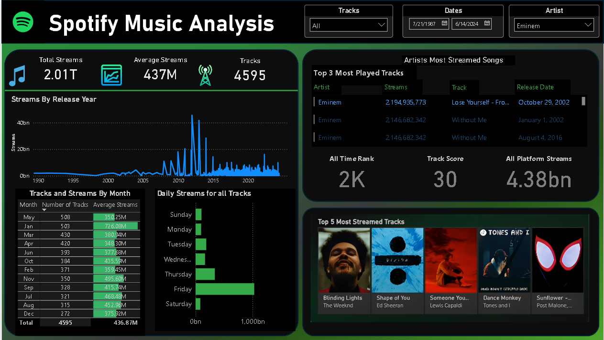

# 🎶 Spotify Music Analysis (Power BI)

An **interactive data analysis project** that uses **Spotify streaming dataset** to uncover music trends, most popular tracks, artist performance, and user listening behavior.  
Built entirely in **Power BI**, this project demonstrates **data cleaning, modeling, and visualization skills** crucial for roles in **Data Analytics, Business Intelligence, and Data Science**.  

---

## 🎯 Project Objective
To analyze Spotify’s most-streamed tracks and artists, identify listening patterns, and present insights through an interactive Power BI dashboard that can support **business decisions** in the music industry.

---

## 📊 Key Dashboard Features

- 📈 **KPIs** – Total Streams (2.01T), Average Streams (437M), Track Count (4595)  
- 📅 **Streams by Release Year** – popularity trends over time  
- 🏆 **Top 3 Most Played Tracks** – Eminem dominates with *Lose Yourself* and *Without Me*  
- 📊 **Tracks & Streams by Month** – highest streaming averages in January & July  
- ⏰ **Daily Listening Trends** – Friday is the peak day for music streaming  
- 🌍 **Top 5 Most Streamed Global Tracks** – *Blinding Lights, Shape of You, Someone You Loved* etc.  
- 📌 **All Platform Streams & Rankings** – consolidated view of global music performance  

---

## 🛠️ Tools & Technologies
- **Power BI** – dashboard design & data visualization  
- **Power Query** – data cleaning & transformation  
- **DAX** – measures & calculations for KPIs  
- **CSV Dataset** – Spotify Most Streamed Songs (2024)  

---

## 📂 Project Files
- `Spotify data Analysis Project.pbix` → Power BI Project File  
- `Most Streamed Spotify Songs 2024.csv` → Dataset  
- `Dashboard.png` → Dashboard Screenshot  

---

## 📷 Dashboard Preview

---

## 🎥 Project Demo Video
👉 [Watch Project Video](https://youtu.be/6o3D30GzKw4)

---

## 📌 Insights Gained
- 🎤 **Eminem** remains one of the most-streamed artists with multiple timeless hits.  
- 🗓 **Friday** is the most popular day for streaming, reflecting weekend trends.  
- 🌍 Global hits like **Blinding Lights** and **Shape of You** continue to dominate.  
- 📊 Seasonality effect seen with higher streams in **January & July**.  

---

## 💡 Business Impact
This analysis can help:  
- 🎶 **Music Labels** – track which songs/artists are trending globally  
- 📱 **Streaming Platforms** – understand user behavior to improve recommendations  
- 💼 **Marketing Teams** – identify peak times for promotions and releases  

---

## 🔮 Future Enhancements
- Integration with **real-time Spotify API**  
- Adding **predictive analytics** (e.g., forecasting future top songs)  
- Expanding to include **regional trends** and genre-based analysis  
- Automating dataset refresh using **Power BI Service + Cloud Schedulers**  

---

## 📌 Skills Demonstrated
- ✅ Data Cleaning & Preparation (Power Query)  
- ✅ Data Modeling (relationships, KPIs, DAX)  
- ✅ Business Intelligence Dashboarding (Power BI)  
- ✅ Analytical Storytelling (insights & recommendations)  
- ✅ Real-World Problem Solving (music industry insights)  
---
